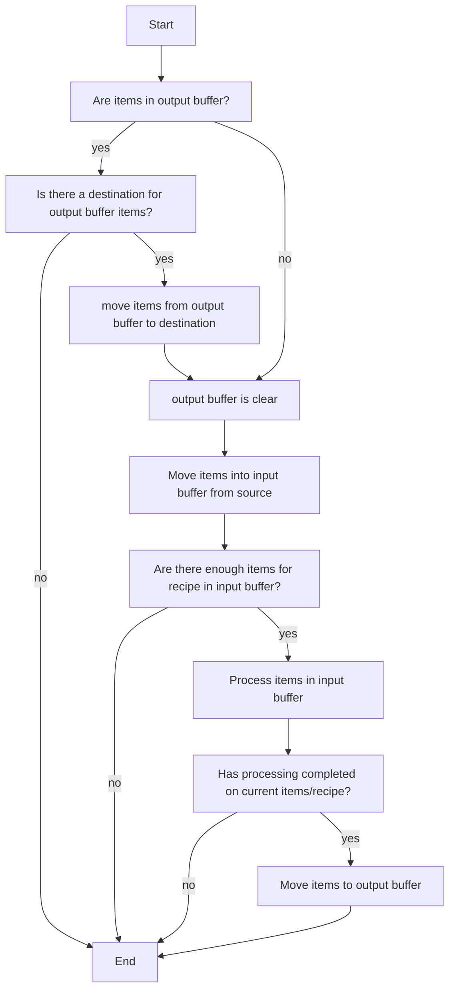
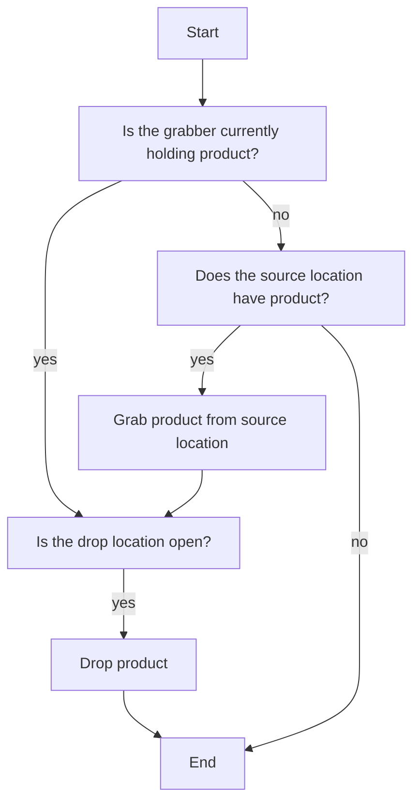
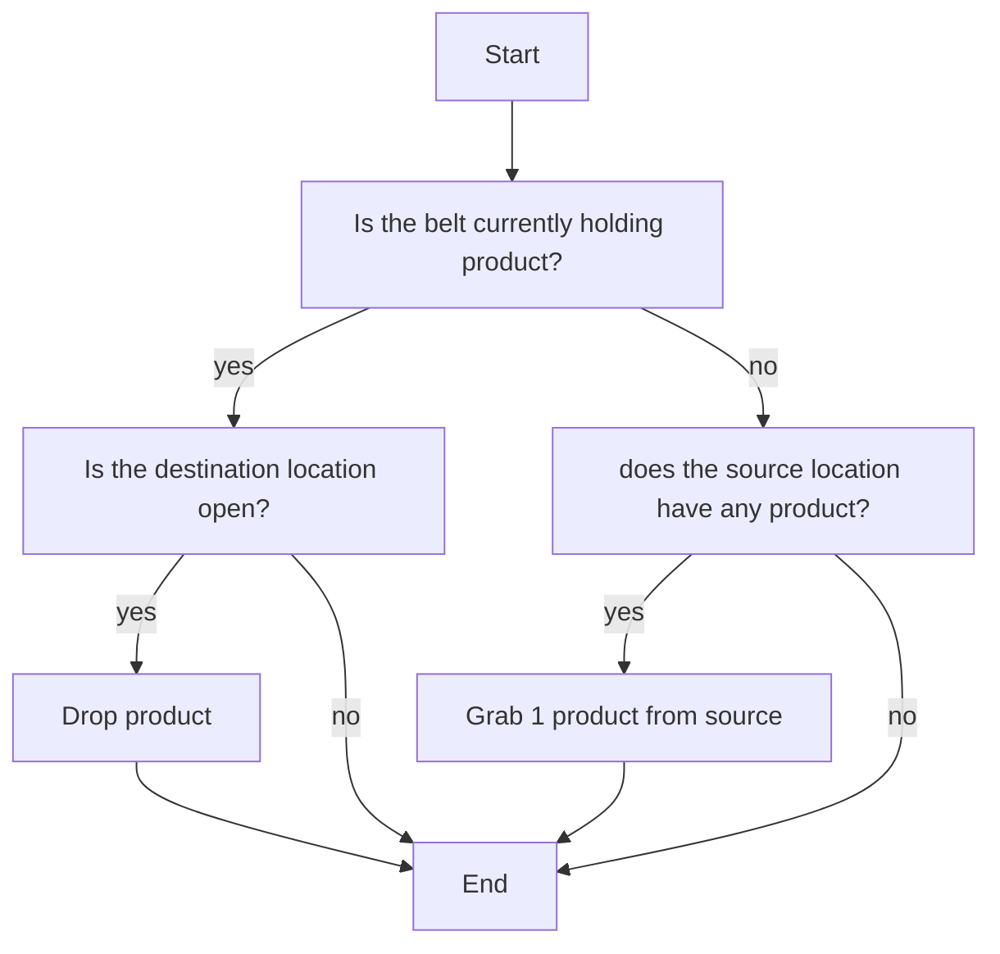

# Factory - don't use this project
[](https://github.com/samsmithnz/Factory/actions/workflows/workflow.yml)
[](https://coveralls.io/github/samsmithnz/Factory?branch=main)
[](https://sonarcloud.io/summary/new_code?id=samsmithnz_Factory)
[](https://github.com/samsmithnz/Factory/releases)

A factory simulator, simular to the games Factorio, Satisfactory, and Dyson Sphere Program.

# How this works

## A note about processing order
- The obvious question came up about how to handle order of processing - should each machine dump on others, or be dumpped on. After some analysis , it became clear that each machine needs to be dumpped on - so that it can first process it's workload. Let's play it out.
- Gets dumpped on:
    - Needs to have a relationship with the dumper
	- Needs to know the source and pull from the source
	- looks upstream
- Dumps on others:
    - Doesn't care about what it dumps on or others. Just does their job and dumps on them.
	- Doesn't need to know about the destination - just drop if there is space
    - Looks downstream

Let's look at two examples, first moving product to a blank machine:
```
--------
|1|->|0|
--------
dumpped on: right moves to left
dumps on others: left moves to right
```

Second, we will look at an example where a machine is passing product to a machine that is already processing product
```
--------
|1|->|1|
--------
dumpped on: right moves first, then left, as right has moved already
dumps on others: can't move to next until it moves already
```

**Clearly being dumpped on is the correct strategy.**

Let's look at the same two examples, and the direction of processing:
```
--------
|1|->|0|
--------
beginning to end: right moves to left, then nothing.
end to beginning: nothing, then left moves to right
```

Second, we will look at an example where a machine is passing product to a machine that is already processing product
```
--------
|1|->|1|
--------
beginning to end: right can't move to left, then right moves to left
end to beginning: right moves to left, then right moves to left
```

**Moving from end to beginning is the correct strategy.**

## Summary of approach

Ok, so we are using linked lists, with multiple parents, and one child - therefore n:1. Each machine will have 0-n (practically it's a max of 3 though) parents. 
This means when they are multiple parents, they need to take turns - so we need to give them a priority/ next ticket with a number. Not sure if it will be better to do this calc for the entire belt, or at the sorting time


This was backed up by this [blog](https://blog.wetzold.com/2021/05/08/creating-a-factory-automation-game-with-unity-in-three-days-for-ludum-dare/) post: , that states `The biggest break-though was to treat everything as a machine which would produce something, also conveyors and drills and even the rocket, with a specified input and output but using a different production strategy`. Also this [youtube video](https://www.youtube.com/watch?v=88cIVR4KI_Q) was incredibly helpful
Processing strategies:
- Time: create resources inside the machine
- Formula: Convert input materials into output materials, consuming them
- Forward: Take material from input and put it into the output without changing it


What if there is just a hopper that accepts inputs. 
 - This is also inprogress - as shown for belts + grabbers. 
 - For factories - the inputs stay in the hopper until they are done - they just need to wait for the timer to finish.
 - This removes inprogress. When checking the source for content - we need to check the machine strategy, and then either the hopper or output buffer.

## Machine logic
A machine processes inputs to create a new processed output. 

### Properties
- A recipe: details the inputs, processing time, and outputs
- Input buffer: Each machine can buffer a certain number of items. These are pulled off the conveyor belt and held until there is enough to process the recipe. A belt and grabber automatically bypasses this step.
- In progress product in the machine
- In progress wait time: The amount of time the machine needs to process the inputs. Belts and grabbers bypass this step
- Output buffer: Each machine can buffer a certain number of items. These are held until there is enough space on the conveyor belt before being pushed. A belt and grabber automatically bypasses this step.
- Location
- Orientation

### Process
A machine runs within a 'tick'. Each tick represents a cycle of time (perhaps a second). In this tick, the machine does the following operations
- Check if there is any product in the output buffer, and output it if possible 
- Check if there is any finished product in the processing buffer, and move it to the output buffer if possible 
- Check if there are any items to the input buffer to move to the processing buffer if possible 
- Check if there are any items to move the input buffer if possible 



## Grabber logic
A grabber moves an item from a machine, belt, or storage to a new machine, belt, or storage.

### Properties
- Source
- Destintation
- Product in progress in the machine
- Location
- Orientation

### Process
A grabber runs within a 'tick', a short period of time  
- Check if the drop location is empty
- Check if there is any product currently grabbed, and drop it in the drop location
- Check if there is any product to grab, grabbing an item if available



## Conveyor belt logic
A converyor belt moves items from a source to destination. Multiple belts are linked together

### Properties
- Source
- Destintation
- Product in progress in the machine
- Location
- Orientation
- 
### Process


